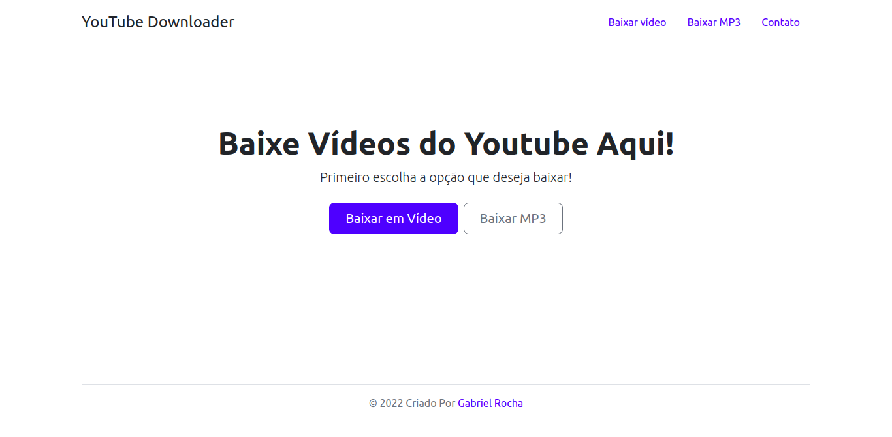
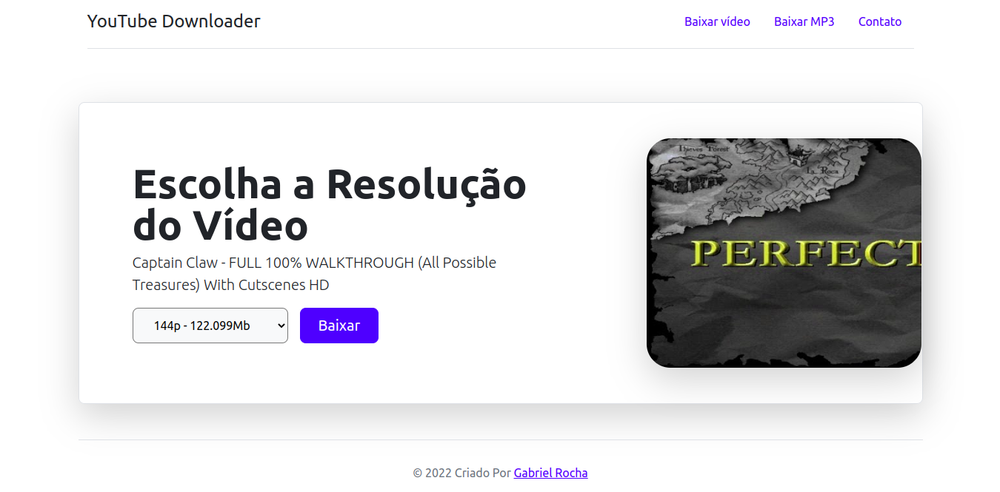

# What this project is about:

## <a href="https://yt-downloader-application.herokuapp.com/" target="_blanck">Link of project deployed</a>

This project was created to download videos from youtube, in video format and mp3 format. I used django and its libraries to do this task, and deployed in heroku. 

It was used django templates to render pages, and pytube to open a new window in the browser, where you can download the video without having to using the heroku server, since it would increase a lot the time to download.

In this application you can see the size of the file you will download, and choose the resolution of the video you want to download.

## Image overview

 

## Main technologies
- HTML
- CSS
- JAVASCRIPT
- BOOTSTRAP
- PYTHON
- DJANGO

## Main Libraries of Django used:
- Pytube
- ipdb (to debug the code)
- Jninja

